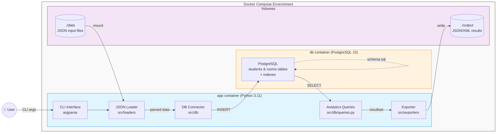

# 🏫 Internship PostgreSQL ETL

Production-ready ETL-решение для загрузки данных о студентах и комнатах из JSON в PostgreSQL с аналитическими запросами и экспортом результатов.

## ✨ Features

- 📥 Загрузка JSON-файлов (`students.json`, `rooms.json`) в PostgreSQL
- 📊 4 аналитических запроса:
  - Количество студентов в каждой комнате
  - Топ-5 комнат с минимальным средним возрастом
  - Топ-5 комнат с максимальной разницей в возрасте
  - Комнаты с разнополыми студентами
- 🔍 Автоматическая генерация SQL-скрипта для создания индексов
- 📤 Экспорт результатов в JSON или XML
- 🐳 Полностью контейнеризировано (Docker + Docker Compose)
- ⚙️ Конфигурация через CLI-аргументы и `.env`

## 🛠 Tech Stack

- **Language:** Python 3.12
- **Database:** PostgreSQL 15
- **Containerization:** Docker, Docker Compose
- **Libraries:** `psycopg2-binary`, `argparse`, `xml.etree.ElementTree`
- **Standards:** PEP 8, SOLID, no ORM

## 🏗 Architecture



## 🚀 Quick Start

### Prerequisites
- Docker и Docker Compose
- Git

### Installation & Run
```bash
# 1. Клонируй репозиторий
git clone https://github.com/your-username/internship-postgres-etl.git
cd internship-postgres-etl

# 2. Создай .env из шаблона
cp .env.example .env

# 3. Запусти контейнеры
docker compose up --build
```

## 💻 Usage
```bash
python -m src.cli \
  --students ./data/students.json \
  --rooms ./data/rooms.json \
  --format json
```

| Parameter | Required | Description |
|-----------|----------|-------------|
| `--students` | ✅ | Путь к файлу `students.json` |
| `--rooms`    | ✅ | Путь к файлу `rooms.json` |
| `--format`   | ✅ | Формат вывода: `json` или `xml` |

## ⚙️ Configuration

| Variable | Default | Description |
|----------|---------|-------------|
| `POSTGRES_HOST` | `db` | Хост БД |
| `POSTGRES_PORT` | `5432` | Порт БД |
| `POSTGRES_DB`   | `internship` | Имя БД |
| `POSTGRES_USER` | `app` | Логин |
| `POSTGRES_PASSWORD` | — | Пароль (задать в `.env`) |

## 📁 Project Structure

```
internship-postgres-etl/
├── config/         # Настройки и валидация конфигов
├── src/
│   ├── db/         # Работа с БД (connector, queries)
│   ├── loaders/    # Парсинг JSON
│   ├── exporters/  # Экспорт в JSON/XML
│   └── cli.py      # Точка входа
├── sql/
│   ├── schema.sql  # DDL: таблицы, индексы
│   └── indexes.sql # Сгенерированный скрипт оптимизаций
├── docker-compose.yml
├── Dockerfile
└── .env.example
```

## 📊 Analytics Queries

1. **Students per room** — `COUNT(*)` сгруппированный по `room_id`
2. **Lowest average age** — `AVG(age)` с `ORDER BY ... LIMIT 5`
3. **Largest age difference** — `MAX(age) - MIN(age)` на группу
4. **Mixed-sex rooms** — `HAVING COUNT(DISTINCT sex) > 1`

> 💡 All computation is performed at the database level (no in-memory processing).

## 🔍 Indexing Strategy

Скрипт `sql/indexes.sql` создаёт индексы для оптимизации аналитических запросов:
- B-tree на `students.room_id` (для JOIN и GROUP BY)
- B-tree на `students.age` (для сортировок и агрегаций)

## 🧪 Development

```bash
python -m venv .venv
source .venv/bin/activate
pip install -r requirements.txt
docker compose up -d db
python -m src.cli --students ./data/students.json --rooms ./data/rooms.json --format json
```
