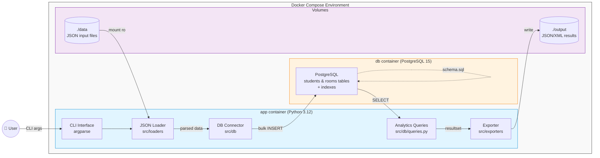
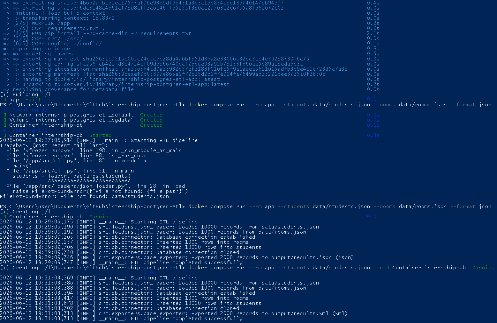

# 🏫 Internship PostgreSQL ETL

Production-ready ETL-решение для загрузки данных о студентах и комнатах из JSON в PostgreSQL с аналитическими запросами и экспортом результатов.

## ✨ Features

- 📥 Загрузка JSON-файлов (`students.json`, `rooms.json`) в PostgreSQL с валидацией (Fail Fast)
- 📊 4 аналитических запроса, выполняемых **полностью на стороне БД**:
  - Количество студентов в каждой комнате
  - Топ-5 комнат с минимальным средним возрастом
  - Топ-5 комнат с максимальной разницей в возрасте
  - Комнаты с разнополыми студентами
- 📤 Экспорт результатов в JSON или XML с санитизацией тегов
- 🐳 Полностью контейнеризировано (Docker + Docker Compose с healthchecks)
- ⚙️ Конфигурация через CLI-аргументы и `.env`
- 🔒 Идемпотентность: безопасный перезапуск пайплайна без дубликатов

## 🛠 Tech Stack

- **Language:** Python 3.12
- **Database:** PostgreSQL 15 (Alpine)
- **Containerization:** Docker, Docker Compose
- **Libraries:** `psycopg2-binary`, `argparse`, `xml.etree.ElementTree`
- **Standards:** PEP 8, Dependency Injection, no ORM

## 🏗 Architecture



## 🚀 Quick Start

### Prerequisites
- Docker и Docker Compose
- Git

### Installation & Run
```bash
# 1. Клонируй репозиторий
git clone https://github.com/z10n/internship-postgres-etl.git
cd internship-postgres-etl

# 2. Создай .env файл с секретами
echo "POSTGRES_DB=internship" > .env
echo "POSTGRES_USER=app" >> .env
echo "POSTGRES_PASSWORD=my_secure_password_123" >> .env
echo "LOG_LEVEL=INFO" >> .env

# 3. Собери образы и запусти БД
docker compose up --build -d

# 4. Выполни ETL-пайплайн (JSON)
docker compose run --rm app \
  --students data/students.json \
  --rooms data/rooms.json \
  --format json

# Или экспорт в XML
docker compose run --rm app \
  --students data/students.json \
  --rooms data/rooms.json \
  --format xml
```
⚠️ Файл .env добавлен в .gitignore. Никогда не коммить секреты!

## 💻 Usage

| Parameter | Required | Description |
|-----------|----------|-------------|
| `--students` | ✅ | Путь к файлу `students.json` |
| `--rooms`    | ✅ | Путь к файлу `rooms.json` |
| `--format`   | ✅ | Формат вывода: `json` или `xml` |

Результаты сохраняются в папку ./output/:
output/results.json — при --format json
output/results.xml — при --format xml

## 💻 Пример работы


## ⚙️ Configuration

| Variable | Default | Description |
|----------|---------|-------------|
| `POSTGRES_HOST` | `db` | Хост БД  (имя сервиса в docker-compose)|
| `POSTGRES_PORT` | `5432` | Порт БД |
| `POSTGRES_DB`   | `internship` | Имя БД |
| `POSTGRES_USER` | `app` | Логин |
| `POSTGRES_PASSWORD` | — | Пароль (обязательно задать в `.env`) |
| `LOG_LEVEL` | INFO | Уровень логирования (DEBUG/INFO/WARNING/ERROR) |

## 📁 Project Structure

```
internship-postgres-etl/
├── config/
│   └── settings.py          # Dataclass-конфигурация (frozen=True)
├── sql/
│   └── schema.sql           # DDL: таблицы, индексы, constraints
├── src/
│   ├── cli.py               # Точка входа, оркестрация пайплайна
│   ├── db/
│   │   ├── connector.py     # Контекстный менеджер соединений, bulk_insert
│   │   └── queries.py       # 4 аналитических SQL-запроса
│   ├── exporters/
│   │   └── base_exporter.py # Экспорт в JSON/XML с санитизацией тегов
│   └── loaders/
│       └── json_loader.py   # Загрузка JSON с валидацией (Fail Fast)
├── data/                    # Входные JSON-файлы (монтируется read-only)
├── output/                  # Результаты экспорта
├── docs/                    # Документация и скриншоты
├── docker-compose.yml
├── Dockerfile
├── pyproject.toml
└── .env                     # Секреты (не в Git!)
```

## 📊 Analytics Queries

Все вычисления выполняются на стороне PostgreSQL (требование ТЗ):

| # | Запрос | SQL-выражение | Описание |
|---|--------|---------------|----------|
| 1 | Students per room | `COUNT(s.id)` + `LEFT JOIN` | Количество студентов в каждой комнате (включая пустые) |
| 2 | Lowest avg age | `AVG(EXTRACT(YEAR FROM AGE(CURRENT_DATE, birthday)))` | Топ-5 комнат с минимальным средним возрастом |
| 3 | Largest age diff | `MAX(...) - MIN(...)` | Топ-5 комнат с максимальной разницей возрастов |
| 4 | Mixed sex rooms | `HAVING COUNT(DISTINCT sex) > 1` | Комнаты, где живут студенты обоих полов |

> 💡 All computation is performed at the database level (no in-memory processing).

## 🔍 Indexing Strategy

Индексы определены в sql/schema.sql для оптимизации аналитических запросов:
* B-tree на students.room — ускоряет JOIN, GROUP BY и фильтрацию по комнатам
* B-tree на students.birthday — ускоряет вычисление возраста и сортировки
* PRIMARY KEY на rooms.id и students.id — обеспечивает целостность и быстрые lookups

## 🔑 Ключевые архитектурные решения
### Dependency Injection: 
Settings передаётся в DatabaseConnector через __init__, а не читается внутри класса → тестируемость и гибкость

**Fail Fast:** Валидация данных на границе системы (JsonLoader проверяет тип, Exporter проверяет формат) → понятные ошибки вместо загадочных падений глубже

**Безопасность соединений:** @contextmanager гарантирует close() и rollback() даже при исключениях → нет утечек соединений

**Производительность:** execute_values для батчевой вставки → 1 сетевой запрос вместо N, ускорение в 40–100 раз

**Идемпотентность:** ON CONFLICT DO NOTHING позволяет безопасно перезапускать пайплайн без дубликатов и ошибок FK

**Memory-efficient:** Генераторы и прямая запись в файл без промежуточных строк → обработка файлов больше RAM

**XML-безопасность:** Санитизация имён тегов защищает от невалидных символов в именах колонок SQL

## 🧪 Development (локально без Docker)

```bash
# Создай виртуальное окружение
python -m venv .venv
source .venv/bin/activate  # Linux/Mac
# .venv\Scripts\activate   # Windows PowerShell

# Установи зависимости
pip install -r requirements.txt

# Запусти только БД через Docker
docker compose up -d db

# Запусти пайплайн локально
python -m src.cli \
  --students ./data/students.json \
  --rooms ./data/rooms.json \
  --format json
```

## 👤 Автор
**Дмитрий Комягин**

Стажировка Data Engineering, 2026
